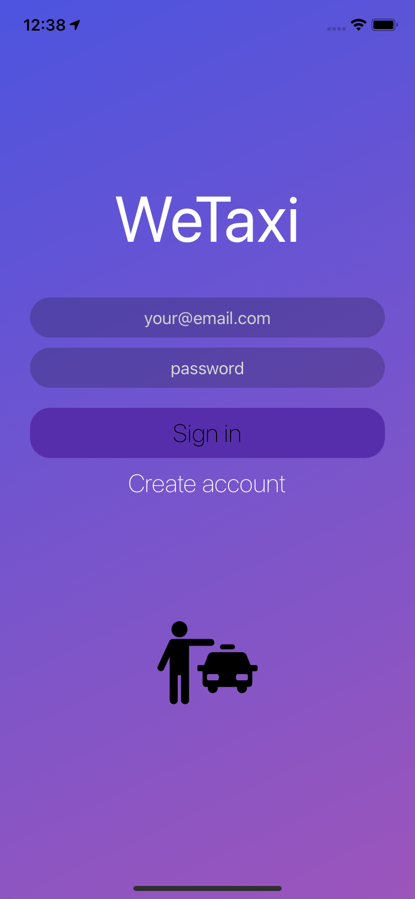
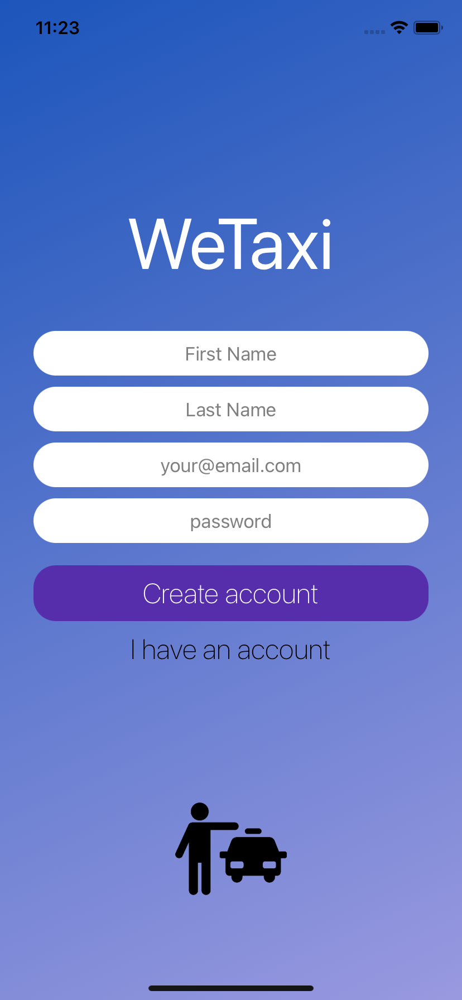

# WeTaxi
A React-Native App that links Taxi Drivers and Passengers.

## Functionalities
* Signup / Login / Authentication
* Passenger search place to go, receives a route and ask for a Taxi Driver
* Taxi Driver will receive Passenger's location and choose to accept the ride
* If a Taxi Driver accept the ride, the Passenger receives a notification and Driver's background location to watch the trip.

Type a location on the search box and the app will determine and trace the route on the google map.

<!-- [YelpCamp Website](https://enigmatic-sea-52160.herokuapp.com/) -->

## Tech/framework used
* React-native
* Express
* Socket.io
* Mongodb
* Google Maps Api

## Installation - yarn
### Prerequisites
To run this project in the development mode, you'll need to have a basic environment to run a React-Native App, that can be found [here](https://reactnative.dev/docs/environment-setup).

Also, you'll need to the server running locally on your machine with the mock data. You can find the server and all the instructions to start the server [here](https://github.com/daniel30-07/taxi-app-socket.io).

### Installing
Cloning the Repository

$ git clone https://github.com/daniel30-07/taxi-app-react-native.git

$ yarn

or

$ npm install

Connecting the App with the Server
1 - Follow the instructions on the taxi-app-socket.io and taxi-app-express to have the server running on your machine.

2 - With the server up and running, go to the ./baseUrl.js file and edit the value of the field baseURL and socketIoURL with the IP of your machine.

### Running
With all dependencies installed and the environment properly configured, you can now run the app:

Android

$ yarn android

iOS

$ yarn ios
